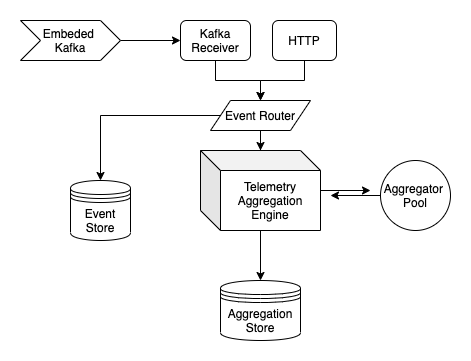

# Telemetry Event aggregation service
Event based service for aggregation of telemetry vehicle data.

## Architecture
This application is written as an engine-based aggregation service. There are 2 entry points - kafka and http, both of which are able to consume events, which are router to the aggregation engine.
During routing, validation is performed, in the context of a single telemetry, based on some assumed busines constraints (see TelemetryValidationService.class).
Each telemetry event is validated, aggregated and finally persistend to the event storage (for event storage purposes).

<i>Simple Architecture Diagram:</i>



#### Aggregation engine
An aggregation event orchestrator over a defined Aggregator pool.  Capable of managing event routing of specific vehicle telemetries to their respective Aggregators, periodically releasing the Aggregators, causing them to aggregate over the accumulated batch.
Each aggregator is an instance of the Aggregator class capable of collecting a batch of id specific telemetries, aggregating them on release.
If the aggregator pool is empty, the engine will block until an aggregator resource is released and ready for a new batch aggregation.


## Testing
<b>Run with `mvn clean install && mvn exec:java`.</b>


Application is configured to run on port 8086.
Any configuration properties can be changed via the `application.properties` file.

### Embedded kafka
This application will run an embedded Kafka service (def.port 9093, configurable). 
A simple <b>event producer</b> is setup to periodically send telemetry events to the Kafka listener, simulating accelerating vehicles.
This kafka producer/consumer lifecycle can be observed trough the logs. 
The configuration property, to increase/decrease the publishing interval is `kafka.embedded.runner.interval`.


Kafka listener is configured with the properties, it can be used to recieve events from a concrete Kafka.
```
spring.kafka.template.default-topic=telemetry
spring.kafka.consumer.group-id=consumer-group
spring.kafka.bootstrap-servers=localhost:9093
```

### HTTP
This application will also serve a simple HTTP API. It exposes an interface to manually submit a list of events, and to get the aggregated statistics of a vehicle.
Available endpoints are: 
* [GET] `/statistics/{{ID}}`
* [POST] `/telemetry`

#### [GET] `/statistics/{{ID}}`
Endpoint for getting the last aggregated vehicle statistics. Path parameter `ID` is of type `UUID` and represents the id of the vehicle. 

##### Usage
Request: [GET] `/statistics/199c2b46-3f21-4e19-8c25-bb51b224e54e`
Response:
```
{
    "id": "199c2b46-3f21-4e19-8c25-bb51b224e54e",
    "averageSpeed": 12.0,
    "maximumSpeed": 2.0,
    "lastMessageTimestamp": 1635772682505,
    "numberOfCharges": 0,
    "currentState": "DRIVING"
}
```


#### [POST] `/telemetry`
Endpoint for posting of a list of vehicle telemetries to the aggregation service. Used to simulate a stream of kafka events.

Additional input data examples can be found under `src/main/resources/examples` folder.

##### Usage
Request: [POST] `/telemetry`
```
[
    {
        "id": "199c2b46-3f21-4e19-8c25-bb51b224e54e",
        "recordedAt": 1635772682505,
        "signalValues":{
            "DRIVING_TIME": 1.0,
            "ODOMETER": 12.0,
            "CURRENT_SPEED": 2.0,
            "IS_CHARGING": 0.0
        }
    },
    {
        "id": "199c2b46-3f21-4e19-8c25-bb51b224e54e",
        "recordedAt": 1635772682505,
        "signalValues":{
            "DRIVING_TIME": 1.0,
            "ODOMETER": 12.0,
            "CURRENT_SPEED": 2.0,
            "IS_CHARGING": 0.0
        }
    }
]
```
Response:
```
Successfully published telemetries
```
